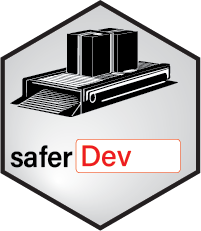

# saferDev <a href="">[](https://safer-r.github.io/saferDev)</a>

<br />

<!-- badges: start -->

[](https://app.codecov.io/github/safer-r/saferDev?branch=master)
[](https://cran.r-project.org/package=saferDev)
[](https://www.rdocumentation.org/trends)
[](https://opensource.org/licenses/MITgpl-3-0)
[](https://github.com/safer-r/saferDev/actions/workflows/rworkflows.yml)
<!-- badges: end -->

<br />

## Table of content

   - [Description](#description)
   - [Content](#content)
   - [Versions](#versions)
   - [Installation](#installation)
   - [Licence](#licence)
   - [Citations](#citations)
   - [Credits](#credits)
   - [Acknowledgements](#acknowledgements)

<br />

## Description

Set of R functions for the development of R functions, written according to the [safer project](https://github.com/safer-r) specifications.

<br />

## Content
<br />

| Function | Description |
| :--- | :--- |
| **arg_check()** | Check expected values of arguments of functions: class, type, mode, length, restricted values panel, kind of numeric values in addition to the distinction between 'integer' and 'double' (proportion only? Inf values authorized? negative values authorized? Integers of type 'double'?). |
| **arg_test()** | Test a set of values for a defined set of arguments of a function. Contrary to `testthat::test_that()`, the function test a batch of values and control only if an error is returned or not. |
| **env_check()** | Verify that object names in the environment defined by the pos argument are identical or not to object names in the above environments (following R Scope). This can be used to verify that names used for objects inside a function or in the working environment do not override names of objects already present in the above R environments, following the R scope. |
| **get_message()** | Return the error, warning or simple (non error non warning) message if ever exist of an instruction written between quotes. |
| **is_function_here()** | Check if required functions are present in installed packages. This controls modifications in of function names package versions. |
| **is_package_here()** | Check if required packages are installed locally. |
| **is_python_package_here()** | Check if required python packages are installed locally. |
| **report()** | Print a character string or a data object into a same log file. |

<br />

Read `vignette("saferDev")` for more details.

<br />

## Versions

The different *saferDev* releases are tagged [here](https://github.com/safer-r/saferDev/tags).

<br />

## Installation

*saferDev* can be currently be installed from GitHub:

```r
install.packages("remotes")
remotes::install_github("https://github.com/safer-r/saferDev")
```

Older versions can be installed like this:

```r
v <- "v1.0" # desired tag version
remotes::install_github(paste0("https://github.com/safer-r/saferDev/tree/", v))
```

<br />

## Licence

This package can be redistributed and/or modified under the terms of the GNU General Public License as published by the Free Software Foundation, either version 3 of the License, or (at your option) any later version.
Distributed in the hope that it will be useful, but without any warranty; without even the implied warranty of merchandability or fitness for a particular purpose.
See the GNU General Public License for more details at https://www.gnu.org/licenses.

<br />

## Citation

If you are using functions of *saferDev*, please cite: 

> Han Y, Serizay J, Millot GA (2023). _The R saferDev package_.
> <https://github.com/safer-r/saferDev/>.

<br />

## Credits

[Yushi Han](https://github.com/yushiHn/), Bioinformatics and Biostatistics Hub, Institut Pasteur, Paris, France

[Jacques Serizai](https://github.com/js2264), Spatial Regulation of Genomes team, Institut Pasteur, Paris, France

[Gael A. Millot](https://github.com/gael-millot), Bioinformatics and Biostatistics Hub, Institut Pasteur, Paris, France

<br />

## Acknowledgements

The developers & maintainers of the mentioned softwares and packages, including:

- [R](https://www.r-project.org/)
- [Git](https://git-scm.com/)
- [Github](https://github.com/)

